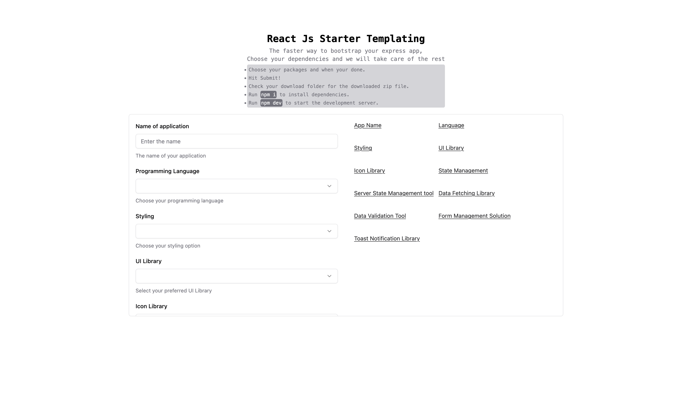
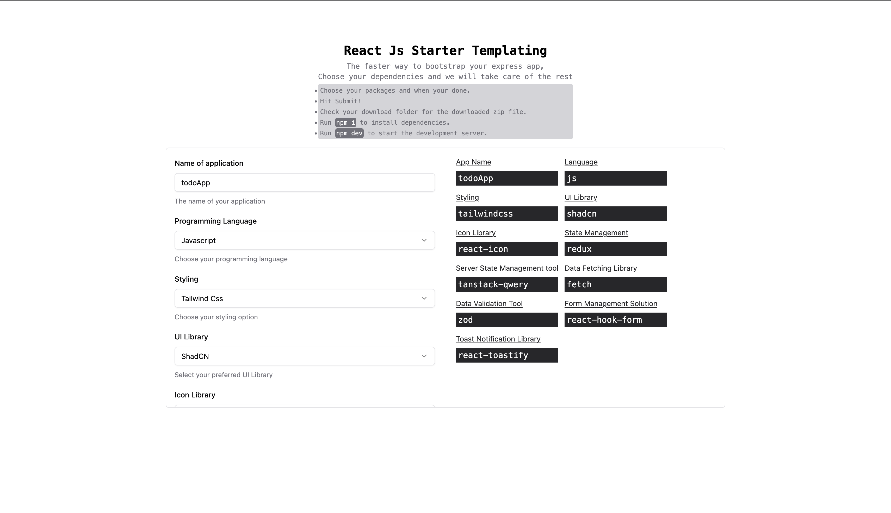

# React Template Generator

A powerful web application that generates customized React project boilerplates with your preferred technology stack. Skip the tedious setup and start coding in seconds!



---

## 🎯 What is This?

The **React Template Generator** is a tool designed to streamline the process of bootstrapping React applications. Instead of spending 30-60 minutes manually configuring your project, dependencies, and folder structure, you can:

1. **Select** your preferred libraries from popular React ecosystem tools
2. **Click** submit to generate your project
3. **Download** a fully configured project as a ZIP file
4. **Extract** and run `npm install`
5. **Start coding** immediately!

---

## ✨ Features

### 🎨 Customizable Technology Stack

Choose from a wide variety of popular React libraries:

- **Language**: JavaScript or TypeScript
- **Styling**: Tailwind CSS or Styled Components
- **UI Components**: ShadCN UI or None
- **Icons**: React Icons or Lucide
- **State Management**: Redux Toolkit or Zustand
- **Server State**: TanStack Query or SWR
- **HTTP Client**: Axios or Fetch API
- **Validation**: Zod or Joi
- **Forms**: React Hook Form or Formik
- **Notifications**: React Toastify or Sonner
- **Routing**: React Router

### 📦 Complete Project Setup

Every generated project includes:

- ✅ Pre-configured `package.json` with all dependencies
- ✅ Proper folder structure (components, pages, layouts, etc.)
- ✅ Configuration files (Vite, Tailwind, ESLint, TypeScript)
- ✅ Boilerplate code for selected libraries
- ✅ Comprehensive README with documentation
- ✅ Ready to run with `npm install && npm run dev`

### 🚀 Instant Generation

- Fast project generation (3-5 seconds)
- Download as ZIP file
- No account required
- No installation needed

---

## 🖼️ Screenshots


*Select your preferred technologies*


*Preview your selections before generating*

---

## 🏗️ Built With

This application is built using modern web technologies:

### Core
- **[Next.js 14](https://nextjs.org/)** - Full-stack React framework
- **[React 18](https://react.dev/)** - UI library
- **[TypeScript](https://www.typescriptlang.org/)** - Type safety

### Styling
- **[Tailwind CSS](https://tailwindcss.com/)** - Utility-first CSS framework
- **[ShadCN UI](https://ui.shadcn.com/)** - High-quality React components
- **[Radix UI](https://www.radix-ui.com/)** - Accessible UI primitives
- **[Lucide Icons](https://lucide.dev/)** - Beautiful icon library

### Form & Validation
- **[React Hook Form](https://react-hook-form.com/)** - Performant form library
- **[Zod](https://zod.dev/)** - TypeScript-first schema validation

### Backend & File Handling
- **[fs-extra](https://github.com/jprichardson/node-fs-extra)** - Enhanced file system operations
- **[Archiver](https://www.archiverjs.com/)** - ZIP file creation
- **[Axios](https://axios-http.com/)** - HTTP client

---

## 🚀 Getting Started

### Prerequisites

- **Node.js** 20 or higher
- **npm** 9 or higher

### Installation

1. **Clone the repository**
   ```bash
   git clone https://github.com/BiggieOneBillion/react-starter.git
   cd react-boilerplate-next-js
   ```

2. **Install dependencies**
   ```bash
   npm install
   ```

3. **Run the development server**
   ```bash
   npm run dev
   ```

4. **Open your browser**
   Navigate to [http://localhost:3000](http://localhost:3000)

---

## 📖 Usage

### Using the Web Interface

1. **Enter Project Name**
   - Choose a name for your project (e.g., "my-awesome-app")

2. **Select Language**
   - Choose between JavaScript or TypeScript

3. **Choose Your Stack**
   - Select your preferred libraries for each category
   - Preview your selections in the summary panel

4. **Generate Project**
   - Click "Submit" to generate your project
   - Wait 3-5 seconds for generation

5. **Download & Setup**
   - Download the ZIP file
   - Extract to your desired location
   - Run `npm install`
   - Run `npm run dev`
   - Start coding!

### Using the API

You can also use the API directly:

```javascript
const response = await fetch('/api/react', {
  method: 'POST',
  headers: { 'Content-Type': 'application/json' },
  body: JSON.stringify({
    projectName: 'my-app',
    lang: 'ts',
    styling: 'tailwindcss',
    uiLibrary: 'shadcn',
    iconsLibrary: 'lucide',
    stateManagement: 'zustand',
    serverState: 'tanstack-qwery',
    dataFetching: 'axios',
    dataValidation: 'zod',
    formManagement: 'react-hook-form',
    toastLibrary: 'sonner',
    router: 'React-router',
  }),
});

const blob = await response.blob();
// Download the blob as a file
```

See [API Documentation](./docs/API_DOCUMENTATION.md) for more details.

---

## 📁 Project Structure

```
react-boilerplate-next-js/
├── app/                    # Next.js app directory
│   ├── (home)/            # Home page route group
│   │   ├── _components/   # Page components
│   │   └── data.tsx       # Configuration options
│   ├── api/               # API routes
│   │   ├── react/         # Project generation endpoint
│   │   ├── templates/     # Base templates
│   │   └── utils.ts       # Generation utilities
│   ├── globals.css        # Global styles
│   ├── layout.tsx         # Root layout
│   └── page.tsx           # Root page
├── components/            # Shared components
│   └── ui/               # ShadCN UI components
├── lib/                  # Utility functions
├── docs/                 # Documentation
├── public/               # Static assets
└── [config files]        # Configuration files
```

---

## 📚 Documentation

Comprehensive documentation is available in the `docs/` folder:

- **[Project Overview](./docs/PROJECT_OVERVIEW.md)** - Detailed project description and features
- **[Technology Stack](./docs/TECHNOLOGY_STACK.md)** - All technologies used with explanations
- **[Architecture](./docs/ARCHITECTURE.md)** - System design and architectural decisions
- **[Developer Guide](./docs/DEVELOPER_GUIDE.md)** - Setup, development, and contribution guide
- **[API Documentation](./docs/API_DOCUMENTATION.md)** - API endpoints and usage

---

## 🎯 Use Cases

### For Beginners
- Learn React without dealing with complex configurations
- Experiment with different library combinations
- Understand how libraries work together

### For Experienced Developers
- Save time on repetitive project setup
- Quickly prototype new ideas
- Standardize team project structure

### For Educators
- Provide students with consistent project setups
- Focus on teaching React, not configuration
- Demonstrate different library combinations

### For Teams
- Standardize project structure across the organization
- Ensure best practices are followed
- Reduce onboarding time for new developers

---

## 🛠️ Development

### Available Scripts

```bash
npm run dev      # Start development server
npm run build    # Build for production
npm start        # Start production server
npm run lint     # Run ESLint
```

### Adding New Libraries

To add support for a new library:

1. **Update data.tsx** with the new option
2. **Add to form schema** in form-option.tsx
3. **Update API handler** in utils.ts
4. **Add setup logic** for the library
5. **Test the generation**

See [Developer Guide](./docs/DEVELOPER_GUIDE.md) for detailed instructions.

---

## 🤝 Contributing

Contributions are welcome! Here's how you can help:

1. **Fork the repository**
2. **Create a feature branch** (`git checkout -b feature/amazing-feature`)
3. **Commit your changes** (`git commit -m 'Add: amazing feature'`)
4. **Push to the branch** (`git push origin feature/amazing-feature`)
5. **Open a Pull Request**

### Contribution Ideas

- Add support for more libraries
- Improve generated project templates
- Add tests
- Improve documentation
- Fix bugs
- Enhance UI/UX

---

## 📝 License

This project is open source and available under the [MIT License](LICENSE).

---

## 🙏 Acknowledgments

- **Next.js Team** - For the amazing framework
- **Vercel** - For hosting and deployment
- **ShadCN** - For the beautiful UI components
- **React Community** - For all the amazing libraries

---

## 📧 Contact

- **GitHub**: [@BiggieOneBillion](https://github.com/BiggieOneBillion)
- **Repository**: [react-starter](https://github.com/BiggieOneBillion/react-starter)

---

## 🔮 Roadmap

### Planned Features

- [ ] Support for Next.js project generation
- [ ] More library options (testing frameworks, etc.)
- [ ] User accounts to save configurations
- [ ] Template preview before download
- [ ] Custom folder structure options
- [ ] GitHub integration (create repo directly)
- [ ] Project analytics
- [ ] Custom templates

---

## ⭐ Show Your Support

If you find this project useful, please consider:

- ⭐ Starring the repository
- 🐛 Reporting bugs
- 💡 Suggesting new features
- 🤝 Contributing code
- 📢 Sharing with others

---

## 📊 Project Stats

- **Language**: TypeScript
- **Framework**: Next.js 14
- **UI Library**: React 18
- **Styling**: Tailwind CSS
- **Components**: ShadCN UI
- **License**: MIT

---

**Made with ❤️ by developers, for developers**

Start building your next React project in seconds! 🚀
