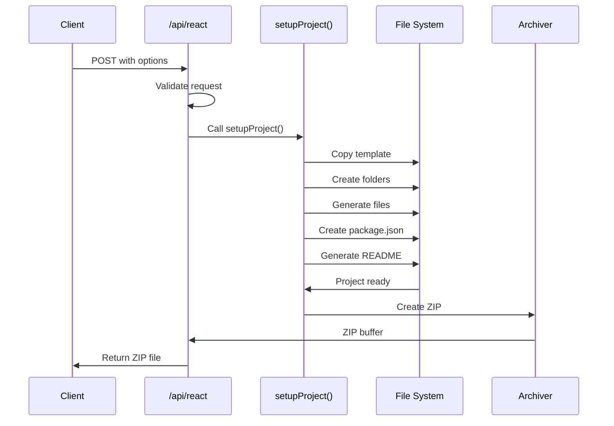

# API Documentation

This document provides detailed information about the API endpoints available in the React Template Generator.

---

## 📋 Overview

The React Template Generator provides a REST API for generating customized React projects. The API is built using Next.js API Routes and handles project generation, file creation, and ZIP packaging.

**Base URL**: `http://localhost:3000/api` (development)

---

## 🔌 Endpoints

### Generate React Project

Generates a customized React project based on provided options and returns it as a ZIP file.

#### Endpoint
```
POST /api/react
```

#### Request Headers
```
Content-Type: application/json
```

#### Request Body

```typescript
{
  projectName: string;        // Project name (required)
  lang: 'js' | 'ts';         // Language (required)
  router: string;             // Router option
  styling: string;            // Styling framework
  uiLibrary: string;          // UI component library
  stateManagement: string;    // State management library
  iconsLibrary: string;       // Icon library
  dataFetching: string;       // HTTP client
  serverState: string;        // Server state management
  formManagement: string;     // Form library
  toastLibrary: string;       // Toast notification library
  dataValidation: string;     // Validation library
}
```

#### Request Body Schema

```typescript
interface ProjectGenerationRequest {
  projectName: string;
  lang: 'js' | 'ts';
  router: 'React-router';
  styling: 'tailwindcss' | 'styled-components';
  uiLibrary: 'shadcn' | 'none';
  iconsLibrary: 'react-icon' | 'lucide';
  stateManagement: 'redux' | 'zustand';
  serverState: 'tanstack-qwery' | 'swr';
  dataFetching: 'axios' | 'fetch';
  dataValidation: 'zod' | 'joi';
  formManagement: 'react-hook-form' | 'formik';
  toastLibrary: 'react-toastify' | 'sonner';
}
```

#### Example Request

```javascript
const response = await fetch('/api/react', {
  method: 'POST',
  headers: {
    'Content-Type': 'application/json',
  },
  body: JSON.stringify({
    projectName: 'my-awesome-app',
    lang: 'ts',
    router: 'React-router',
    styling: 'tailwindcss',
    uiLibrary: 'shadcn',
    iconsLibrary: 'lucide',
    stateManagement: 'zustand',
    serverState: 'tanstack-qwery',
    dataFetching: 'axios',
    dataValidation: 'zod',
    formManagement: 'react-hook-form',
    toastLibrary: 'sonner',
  }),
});

const blob = await response.blob();
const url = window.URL.createObjectURL(blob);
const a = document.createElement('a');
a.href = url;
a.download = 'my-awesome-app.zip';
a.click();
```

#### Using Axios

```typescript
import axios from 'axios';
import { saveAs } from 'file-saver';

const generateProject = async (options: ProjectGenerationRequest) => {
  try {
    const response = await axios.post('/api/react', options, {
      responseType: 'blob', // Important for binary data
    });
    
    const blob = new Blob([response.data], { type: 'application/zip' });
    saveAs(blob, `${options.projectName}.zip`);
    
    return { success: true };
  } catch (error) {
    console.error('Project generation failed:', error);
    return { success: false, error };
  }
};
```

#### Response

**Success Response**

- **Status Code**: `200 OK`
- **Content-Type**: `application/zip`
- **Content-Disposition**: `attachment; filename="[projectName].zip"`
- **Body**: Binary ZIP file data

**Error Response**

- **Status Code**: `500 Internal Server Error`
- **Content-Type**: `application/json`
- **Body**:
  ```json
  {
    "error": "Error message describing what went wrong"
  }
  ```

#### Validation Rules

| Field | Type | Required | Validation |
|-------|------|----------|------------|
| projectName | string | Yes | Min length: 1, Valid folder name |
| lang | enum | Yes | Must be 'js' or 'ts' |
| router | string | Yes | Must be valid router option |
| styling | string | Yes | Must be valid styling option |
| uiLibrary | string | Yes | Must be valid UI library option |
| iconsLibrary | string | Yes | Must be valid icon library option |
| stateManagement | string | Yes | Must be valid state management option |
| serverState | string | Yes | Must be valid server state option |
| dataFetching | string | Yes | Must be valid data fetching option |
| dataValidation | string | Yes | Must be valid validation option |
| formManagement | string | Yes | Must be valid form library option |
| toastLibrary | string | Yes | Must be valid toast library option |

---

## 🎯 Configuration Options

### Language Options

```typescript
type Language = 'js' | 'ts';
```

| Value | Description |
|-------|-------------|
| `js` | JavaScript (ES6+) |
| `ts` | TypeScript |

### Router Options

```typescript
type Router = 'React-router';
```

| Value | Description | Package |
|-------|-------------|---------|
| `React-router` | React Router v6 | `react-router-dom` |

### Styling Options

```typescript
type Styling = 'tailwindcss' | 'styled-components';
```

| Value | Description | Packages |
|-------|-------------|----------|
| `tailwindcss` | Tailwind CSS | `tailwindcss`, `postcss`, `autoprefixer` |
| `styled-components` | Styled Components | `styled-components` |

### UI Library Options

```typescript
type UILibrary = 'shadcn' | 'none';
```

| Value | Description | Dependencies |
|-------|-------------|--------------|
| `shadcn` | ShadCN UI | Radix UI primitives, Tailwind CSS |
| `none` | No UI library | - |

### Icon Library Options

```typescript
type IconsLibrary = 'react-icon' | 'lucide';
```

| Value | Description | Package |
|-------|-------------|---------|
| `react-icon` | React Icons | `react-icons` |
| `lucide` | Lucide React | `lucide-react` |

### State Management Options

```typescript
type StateManagement = 'redux' | 'zustand';
```

| Value | Description | Packages |
|-------|-------------|----------|
| `redux` | Redux Toolkit | `@reduxjs/toolkit`, `react-redux` |
| `zustand` | Zustand | `zustand` |

### Server State Options

```typescript
type ServerState = 'tanstack-qwery' | 'swr';
```

| Value | Description | Package |
|-------|-------------|---------|
| `tanstack-qwery` | TanStack Query | `@tanstack/react-query` |
| `swr` | SWR | `swr` |

### Data Fetching Options

```typescript
type DataFetching = 'axios' | 'fetch';
```

| Value | Description | Package |
|-------|-------------|---------|
| `axios` | Axios | `axios` |
| `fetch` | Fetch API | Built-in |

### Data Validation Options

```typescript
type DataValidation = 'zod' | 'joi';
```

| Value | Description | Package |
|-------|-------------|---------|
| `zod` | Zod | `zod` |
| `joi` | Joi | `joi` |

### Form Management Options

```typescript
type FormManagement = 'react-hook-form' | 'formik';
```

| Value | Description | Package |
|-------|-------------|---------|
| `react-hook-form` | React Hook Form | `react-hook-form` |
| `formik` | Formik | `formik` |

### Toast Library Options

```typescript
type ToastLibrary = 'react-toastify' | 'sonner';
```

| Value | Description | Package |
|-------|-------------|---------|
| `react-toastify` | React Toastify | `react-toastify` |
| `sonner` | Sonner | `sonner` |

---

## 📦 Generated Project Structure

The API generates a project with the following structure:

```
[projectName]/
├── src/
│   ├── api/              # API utilities (if axios/fetch selected)
│   ├── components/       # React components
│   ├── context/          # React context (if needed)
│   ├── layout/           # Layout components (if router selected)
│   ├── lib/              # Utility functions (if ShadCN selected)
│   ├── pages/            # Page components (if router selected)
│   ├── providers/        # Provider components (if TanStack/SWR selected)
│   ├── router/           # Router configuration (if router selected)
│   ├── App.[jsx|tsx]     # Main App component
│   ├── main.[jsx|tsx]    # Entry point
│   └── index.css         # Styles
├── index.html            # HTML template
├── package.json          # Dependencies
├── vite.config.[js|ts]   # Vite configuration
├── tailwind.config.[js|ts] # Tailwind config (if selected)
├── postcss.config.js     # PostCSS config (if Tailwind selected)
├── tsconfig.json         # TypeScript config (if TS selected)
├── .eslintrc.json        # ESLint configuration
└── README.md             # Project documentation
```

---

## 🔄 API Workflow



---

## ⚠️ Error Handling

### Error Codes

| Status Code | Description | Cause |
|-------------|-------------|-------|
| 200 | Success | Project generated successfully |
| 400 | Bad Request | Invalid request body or parameters |
| 500 | Internal Server Error | Server error during generation |

### Error Response Format

```typescript
interface ErrorResponse {
  error: string;
  details?: string;
}
```

### Common Errors

#### Invalid Project Name
```json
{
  "error": "Invalid project name",
  "details": "Project name must be a valid folder name"
}
```

#### Missing Required Field
```json
{
  "error": "Missing required field",
  "details": "Field 'lang' is required"
}
```

#### File System Error
```json
{
  "error": "Failed to generate project",
  "details": "Unable to create project directory"
}
```

---

## 🔒 Rate Limiting

Currently, there is **no rate limiting** implemented. For production use, consider adding:

- **Request rate limiting**: Limit requests per IP
- **Concurrent generation limiting**: Limit simultaneous generations
- **File size limiting**: Limit generated project size

### Recommended Implementation

```typescript
import rateLimit from 'express-rate-limit';

const limiter = rateLimit({
  windowMs: 15 * 60 * 1000, // 15 minutes
  max: 10, // Limit each IP to 10 requests per windowMs
  message: 'Too many requests, please try again later',
});

export async function POST(request: Request) {
  // Apply rate limiting
  await limiter(request);
  
  // ... rest of the handler
}
```

---

## 🧪 Testing the API

### Using cURL

```bash
curl -X POST http://localhost:3000/api/react \
  -H "Content-Type: application/json" \
  -d '{
    "projectName": "test-project",
    "lang": "ts",
    "router": "React-router",
    "styling": "tailwindcss",
    "uiLibrary": "shadcn",
    "iconsLibrary": "lucide",
    "stateManagement": "zustand",
    "serverState": "tanstack-qwery",
    "dataFetching": "axios",
    "dataValidation": "zod",
    "formManagement": "react-hook-form",
    "toastLibrary": "sonner"
  }' \
  --output test-project.zip
```

### Using Postman

1. **Method**: POST
2. **URL**: `http://localhost:3000/api/react`
3. **Headers**: `Content-Type: application/json`
4. **Body**: Raw JSON with project options
5. **Send & Download**: Save response as ZIP file

### Using Thunder Client (VS Code)

1. Create new request
2. Set method to POST
3. Enter URL: `http://localhost:3000/api/react`
4. Add header: `Content-Type: application/json`
5. Add JSON body with options
6. Send and save response

---

## 📊 Performance Considerations

### Response Time

Typical response times:
- **Minimal configuration**: 1-2 seconds
- **Full configuration**: 3-5 seconds
- **With ShadCN UI**: 4-6 seconds

### Optimization Tips

1. **Template Caching**: Cache template files in memory
2. **Async Operations**: Use async file operations
3. **Streaming**: Stream ZIP file instead of buffering
4. **Compression**: Use compression for faster downloads

---

## 🔮 Future API Enhancements

### Planned Features

1. **GET /api/templates**
   - List available templates
   - Return template metadata

2. **GET /api/options**
   - Get all available configuration options
   - Return option metadata

3. **POST /api/validate**
   - Validate project configuration
   - Return validation errors

4. **GET /api/preview**
   - Preview generated project structure
   - Return file tree without generating

5. **WebSocket Support**
   - Real-time generation progress
   - Live updates during generation

---

## 📝 Example Implementations

### React Component

```typescript
import { useState } from 'react';
import axios from 'axios';
import { saveAs } from 'file-saver';

interface ProjectOptions {
  projectName: string;
  lang: 'js' | 'ts';
  // ... other options
}

export function ProjectGenerator() {
  const [loading, setLoading] = useState(false);
  
  const generateProject = async (options: ProjectOptions) => {
    setLoading(true);
    
    try {
      const response = await axios.post('/api/react', options, {
        responseType: 'blob',
      });
      
      const blob = new Blob([response.data], { type: 'application/zip' });
      saveAs(blob, `${options.projectName}.zip`);
      
      alert('Project generated successfully!');
    } catch (error) {
      console.error('Generation failed:', error);
      alert('Failed to generate project');
    } finally {
      setLoading(false);
    }
  };
  
  return (
    <button onClick={() => generateProject(/* options */)} disabled={loading}>
      {loading ? 'Generating...' : 'Generate Project'}
    </button>
  );
}
```

### Node.js Script

```javascript
const axios = require('axios');
const fs = require('fs');

async function generateProject(options) {
  try {
    const response = await axios.post('http://localhost:3000/api/react', options, {
      responseType: 'arraybuffer',
    });
    
    fs.writeFileSync(`${options.projectName}.zip`, response.data);
    console.log('Project generated successfully!');
  } catch (error) {
    console.error('Generation failed:', error.message);
  }
}

generateProject({
  projectName: 'my-app',
  lang: 'ts',
  router: 'React-router',
  styling: 'tailwindcss',
  uiLibrary: 'shadcn',
  iconsLibrary: 'lucide',
  stateManagement: 'zustand',
  serverState: 'tanstack-qwery',
  dataFetching: 'axios',
  dataValidation: 'zod',
  formManagement: 'react-hook-form',
  toastLibrary: 'sonner',
});
```

---

## 🔗 Related Documentation

- [Project Overview](./PROJECT_OVERVIEW.md)
- [Technology Stack](./TECHNOLOGY_STACK.md)
- [Developer Guide](./DEVELOPER_GUIDE.md)
- [Architecture](./ARCHITECTURE.md)

---

For questions or issues with the API, please open an issue on GitHub.
