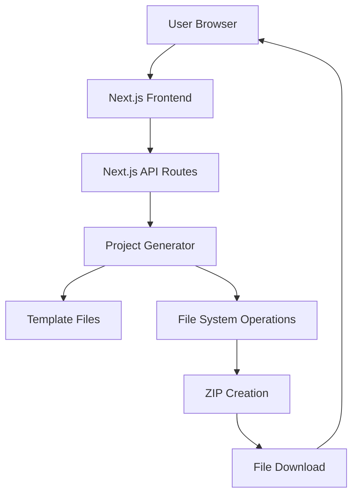
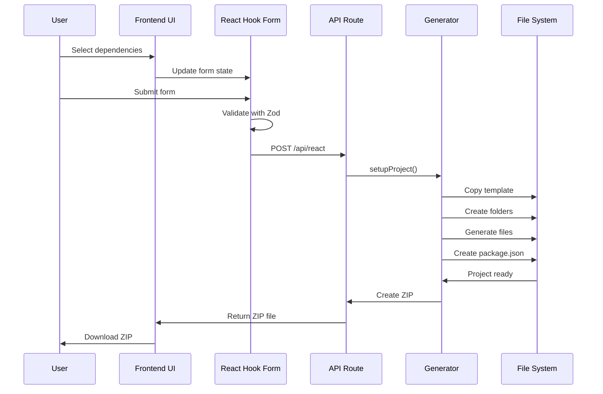
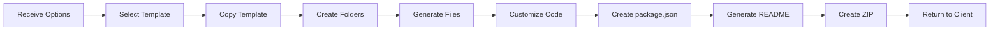

# Architecture & Design

This document explains the architectural decisions, design patterns, and technical implementation details of the React Template Generator.

---

## 🏛️ High-Level Architecture

The application follows a **monolithic Next.js architecture** with clear separation between frontend and backend concerns.



---

## 📁 Project Structure

### Directory Organization

```
react-boilerplate-next-js/
├── app/                          # Next.js App Router
│   ├── (home)/                   # Route group for home page
│   │   ├── _components/          # Private components (not routes)
│   │   │   ├── form-option.tsx   # Main form component
│   │   │   ├── header.tsx        # Page header
│   │   │   ├── home.tsx          # Home page layout
│   │   │   ├── result-alert-dialog.tsx  # Success dialog
│   │   │   └── show-user-values.tsx     # Selected options display
│   │   └── data.tsx              # Configuration options data
│   ├── api/                      # Backend API routes
│   │   ├── react/                # React project generation endpoint
│   │   ├── templates/            # Base project templates
│   │   │   ├── basic/            # JavaScript template
│   │   │   └── basic-ts/         # TypeScript template
│   │   ├── react-setup.ts        # Main setup orchestrator
│   │   ├── react-setup-utils.ts  # JS-specific utilities
│   │   ├── react-ts-setup-utils.ts  # TS-specific utilities
│   │   └── utils.ts              # Core customization logic
│   ├── globals.css               # Global styles + Tailwind
│   ├── layout.tsx                # Root layout component
│   └── page.tsx                  # Root page (redirects to home)
├── components/                   # Shared components
│   └── ui/                       # ShadCN UI components
├── lib/                          # Utility functions
│   └── utils.ts                  # cn() helper for classNames
├── docs/                         # Documentation
└── [config files]                # Various configuration files
```

### Key Design Decisions

#### 1. **Route Groups `(home)`**
- **Purpose**: Organize routes without affecting URL structure
- **Benefit**: Clean URLs while maintaining organized file structure
- **Pattern**: `app/(home)/page.tsx` → URL: `/`

#### 2. **Private Components `_components`**
- **Purpose**: Components that shouldn't be routes
- **Benefit**: Co-locate components with their pages
- **Pattern**: Prefix with `_` to exclude from routing

#### 3. **API Route Separation**
- **Purpose**: Clear backend logic organization
- **Benefit**: Easy to locate and maintain API endpoints
- **Pattern**: `app/api/[endpoint]/route.ts`

---

## 🔄 Data Flow

### User Journey Flow



### Form State Management

```typescript
// Form data structure
interface FormData {
  projectName: string;
  lang: 'js' | 'ts';
  styling: 'tailwindcss' | 'styled-components';
  uiLibrary: 'shadcn' | 'none';
  iconsLibrary: 'react-icon' | 'lucide';
  stateManagement: 'redux' | 'zustand';
  serverState: 'tanstack-qwery' | 'swr';
  dataFetching: 'axios' | 'fetch';
  dataValidation: 'zod' | 'joi';
  formManagement: 'react-hook-form' | 'formik';
  toastLibrary: 'react-toastify' | 'sonner';
}
```

---

## 🎨 Frontend Architecture

### Component Hierarchy

```
Home
├── Header
└── FormOption
    ├── Form (React Hook Form)
    │   ├── Input (Project Name)
    │   ├── Select (Language)
    │   ├── Select (Styling)
    │   ├── Select (UI Library)
    │   ├── Select (Icons)
    │   ├── Select (State Management)
    │   ├── Select (Server State)
    │   ├── Select (Data Fetching)
    │   ├── Select (Validation)
    │   ├── Select (Form Management)
    │   ├── Select (Toast Library)
    │   └── Button (Submit)
    ├── ShowUserValues (Preview)
    └── ResultAlertDialog (Success)
```

### State Management Strategy

**Local State**: React Hook Form
- **Why**: Form-specific state doesn't need global access
- **Benefits**: Optimized re-renders, built-in validation

**No Global State**: Application doesn't require global state
- **Why**: Simple, single-page application
- **Benefits**: Reduced complexity, faster development

### Styling Architecture

**Tailwind CSS** with **CSS Variables**
```css
/* globals.css */
:root {
  --background: 0 0% 100%;
  --foreground: 222.2 84% 4.9%;
  --primary: 222.2 47.4% 11.2%;
  /* ... more variables */
}

.dark {
  --background: 222.2 84% 4.9%;
  --foreground: 210 40% 98%;
  /* ... dark mode overrides */
}
```

**Benefits**:
- Easy theme switching
- Consistent color system
- Type-safe with Tailwind config

### Component Design Pattern

**ShadCN UI Pattern**: Copy components into project
```typescript
// components/ui/button.tsx
import { cva, type VariantProps } from "class-variance-authority"

const buttonVariants = cva(
  "inline-flex items-center justify-center...",
  {
    variants: {
      variant: {
        default: "bg-primary text-primary-foreground...",
        destructive: "bg-destructive text-destructive-foreground...",
        // ... more variants
      },
      size: {
        default: "h-10 px-4 py-2",
        sm: "h-9 rounded-md px-3",
        // ... more sizes
      },
    },
  }
)
```

**Benefits**:
- Full ownership of component code
- Easy customization
- No version lock-in
- Type-safe variants

---

## ⚙️ Backend Architecture

### API Route Structure

```typescript
// app/api/react/route.ts
export async function POST(request: Request) {
  // 1. Parse request body
  const options = await request.json();
  
  // 2. Determine template path
  const templatePath = lang === 'ts' ? 'basic-ts' : 'basic';
  
  // 3. Generate project
  await setupProject({ options, templatePath, templatesPath });
  
  // 4. Create ZIP
  const zipBuffer = await createZip(projectPath);
  
  // 5. Return file
  return new Response(zipBuffer, {
    headers: {
      'Content-Type': 'application/zip',
      'Content-Disposition': `attachment; filename="${projectName}.zip"`
    }
  });
}
```

### Project Generation Pipeline



### Template System

**Base Templates**:
- `basic/` - Minimal JavaScript Vite + React setup
- `basic-ts/` - Minimal TypeScript Vite + React setup

**Customization Process**:
1. **Copy Template**: Clone base template to temp directory
2. **Create Structure**: Generate folder structure based on selections
3. **Add Dependencies**: Build dependency list from selections
4. **Generate Files**: Create configuration and boilerplate files
5. **Write package.json**: Generate with all dependencies
6. **Create README**: Document selected technologies
7. **Cleanup**: Remove temporary files

### File Generation Strategy

**Conditional File Generation**:
```typescript
// Example: Router setup
if (router === 'React-router') {
  reactSetUpInit(
    dependencies,
    projectDir,
    routerDir,
    layoutDir,
    componentDir,
    pagesDir
  );
}

// Example: Styling setup
if (styling === 'tailwindcss') {
  tailwindSetUp(dependencies, projectDir);
} else if (styling === 'Styled-components') {
  dependencies.push('styled-components');
}
```

**Benefits**:
- Only generate needed files
- Avoid bloat
- Clear dependency tree

---

## 🔒 Error Handling

### Frontend Error Handling

```typescript
// Form validation with Zod
const formSchema = z.object({
  projectName: z.string().min(1, "Project name is required"),
  lang: z.enum(['js', 'ts']),
  // ... more validations
});

// API error handling
try {
  const response = await axios.post('/api/react', formData);
  // Success handling
} catch (error) {
  toast.error('Failed to generate project');
  console.error(error);
}
```

### Backend Error Handling

```typescript
// Graceful interruption handling
process.on('SIGINT', () => {
  console.log('\nSetup cancelled by the user.');
  cleanupTemp(tempDir);
  removeSync(projectDir);
  process.exit(1);
});

// File system error handling
if (!existsSync(tempDir)) {
  fsExtra.ensureDirSync(tempDir);
}
```

---

## 🚀 Performance Optimizations

### 1. **Webpack Configuration**
```javascript
// next.config.mjs
webpack(config) {
  // Ignore template files from compilation
  config.module.rules.push({
    test: /api\/templates/,
    loader: 'ignore-loader',
  });
  return config;
}
```
**Benefit**: Prevents Next.js from processing template files, reducing build time

### 2. **React Hook Form**
- **Uncontrolled Components**: Reduces re-renders
- **Validation**: Only validates on submit
- **Performance**: Minimal impact on form interactions

### 3. **Server Components**
- Next.js App Router uses Server Components by default
- Reduces JavaScript sent to client
- Faster initial page load

### 4. **Tailwind CSS**
- **Purging**: Removes unused styles in production
- **JIT**: Just-in-time compilation for faster builds
- **Minimal Bundle**: Only used utilities in final CSS

---

## 🔐 Security Considerations

### 1. **Input Validation**
- **Zod Schema**: Validates all user inputs
- **Type Safety**: TypeScript prevents type errors
- **Sanitization**: Project names are validated

### 2. **File System Operations**
- **Path Validation**: Ensures files are written to correct locations
- **Temp Cleanup**: Removes temporary files after generation
- **No User File Access**: Templates are pre-defined, users can't access arbitrary files

### 3. **API Security**
- **POST Only**: Generation endpoint only accepts POST
- **No Authentication**: Public tool (consider adding for production)
- **Rate Limiting**: Not implemented (consider for production)

---

## 🧪 Testing Strategy

### Current State
- No automated tests currently implemented

### Recommended Testing Approach

**Unit Tests**:
- Utility functions (`utils.ts`)
- Form validation schemas
- Component logic

**Integration Tests**:
- API route handlers
- Project generation pipeline
- File system operations

**E2E Tests**:
- Complete user flow
- Form submission
- File download

**Tools to Consider**:
- **Jest**: Unit testing
- **React Testing Library**: Component testing
- **Playwright**: E2E testing

---

## 📊 Scalability Considerations

### Current Limitations
1. **Synchronous Generation**: Blocks during project creation
2. **No Queue System**: Can't handle concurrent requests efficiently
3. **Memory Usage**: Large projects held in memory
4. **No Caching**: Templates copied every time

### Potential Improvements

**1. Async Processing**
```typescript
// Use background jobs
import { Queue } from 'bull';

const projectQueue = new Queue('project-generation');

projectQueue.process(async (job) => {
  await setupProject(job.data);
});
```

**2. Streaming Response**
```typescript
// Stream ZIP file instead of buffering
const stream = archiver('zip');
return new Response(stream, {
  headers: { 'Content-Type': 'application/zip' }
});
```

**3. Template Caching**
- Cache template files in memory
- Reduce file system reads
- Faster generation

**4. CDN for Templates**
- Store templates in cloud storage
- Reduce server load
- Better availability

---

## 🎯 Design Patterns Used

### 1. **Factory Pattern**
Project generation acts as a factory, creating different project configurations based on input.

### 2. **Strategy Pattern**
Different setup strategies for JavaScript vs TypeScript projects.

### 3. **Builder Pattern**
Incrementally building project structure based on selections.

### 4. **Template Method Pattern**
Base template with customization points for different configurations.

---

## 🔄 Future Architecture Considerations

### Microservices Approach
- **Generation Service**: Separate service for project generation
- **Template Service**: Manage and version templates
- **API Gateway**: Route requests to appropriate services

### Database Integration
- **User Accounts**: Save favorite configurations
- **Analytics**: Track popular library combinations
- **Templates**: Store custom user templates

### Real-time Features
- **WebSockets**: Real-time generation progress
- **Live Preview**: Preview generated project structure
- **Collaborative**: Multiple users working on same config

---

## 📚 Code Organization Principles

### 1. **Separation of Concerns**
- Frontend: UI and user interaction
- Backend: Business logic and file operations
- Components: Reusable, single-responsibility

### 2. **DRY (Don't Repeat Yourself)**
- Shared utilities in `lib/`
- Reusable components in `components/ui/`
- Common setup logic in utility files

### 3. **Single Responsibility**
- Each component has one job
- Each utility function does one thing
- Each API route handles one endpoint

### 4. **Composition Over Inheritance**
- React components composed together
- Utility functions combined
- No deep inheritance hierarchies

---

## 🛠️ Development Workflow

### Local Development
```bash
npm run dev  # Start development server
```
- Hot reload enabled
- TypeScript type checking
- ESLint on save

### Production Build
```bash
npm run build  # Create production build
npm start      # Start production server
```
- Optimized bundles
- Minified code
- Static optimization

### Code Quality
```bash
npm run lint  # Run ESLint
```
- Enforces code standards
- Catches common errors
- Ensures consistency

---

## 📖 Architecture Decision Records (ADRs)

### ADR-001: Next.js App Router
**Decision**: Use Next.js App Router instead of Pages Router

**Rationale**:
- Modern approach
- Better performance with Server Components
- Improved routing features
- Future-proof

**Consequences**:
- Learning curve for team
- Some libraries may not be compatible
- Migration from Pages Router not needed (new project)

### ADR-002: ShadCN UI
**Decision**: Use ShadCN UI instead of component library like MUI

**Rationale**:
- Full code ownership
- Easy customization
- No dependency lock-in
- Tailwind integration

**Consequences**:
- Manual component updates
- More initial setup
- Need to maintain component code

### ADR-003: No Global State Management
**Decision**: Don't use Redux, Zustand, or other global state

**Rationale**:
- Simple application
- Form state is local
- No shared state needed
- Reduces complexity

**Consequences**:
- May need refactor if app grows
- No centralized state debugging
- Easier to understand for new developers

---

This architecture provides a solid foundation for the React Template Generator while remaining simple and maintainable. The design allows for future enhancements without major refactoring.
